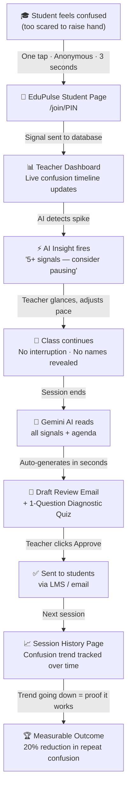

# EduPulse — Solution Flow Diagram
### How It Works: End to End

---

## 🔁 The Complete Loop

---

## 📋 Plain Language Version (Explain This to Anyone)

### Phase 1 — During Class (Real-Time)

| Who | What happens |
|---|---|
| Student | Feels confused. Opens phone browser. Taps "I'm Confused." Done. |
| EduPulse | Logs the signal anonymously. Counts it. |
| Teacher | Sees the confusion load go up on their screen. Gets an AI nudge: *"Consider a quick recap."* |
| Class | Never stops. Teacher can adjust on the fly with a single sentence. |

### Phase 2 — After Class (Automated Remediation)

| Who | What happens |
|---|---|
| Teacher | Session ends. Goes to the AI Summary page. |
| EduPulse AI | Has already drafted a personalized review email + 1 diagnostic quiz based on that session's exact confusion data. |
| Teacher | Reads it. Clicks **Approve & Send**. One click. Done. |
| Student | Receives a review email addressing exactly what they were confused about — anonymously triggered. |

### Phase 3 — Over Time (Proof It Works)

| Session | Confusion Signals |
|---|---|
| Session 1 | 45 signals on "Pointers" |
| Session 2 | 32 signals on "Pointers" |
| Session 3 | 18 signals on "Pointers" |
| Session 4 | 9 signals on "Pointers" |

> **The trend line goes down. That's the proof.**

---

## ⏱️ Time Comparison

| Without EduPulse | With EduPulse |
|---|---|
| Teacher discovers confusion → **at exam results, 6 weeks later** | Teacher discovers confusion → **same session, real-time** |
| Student never gets help on that topic | Student gets AI-drafted review email **within hours** |
| At-risk student drops out → nobody saw it coming | At-risk student flagged → **3–4 weeks early** |

---

## 🎤 One Sentence for the Pitch

> *"EduPulse turns a student's silent confusion into a teacher's real-time action — in 3 seconds during class, and in one click after."*
